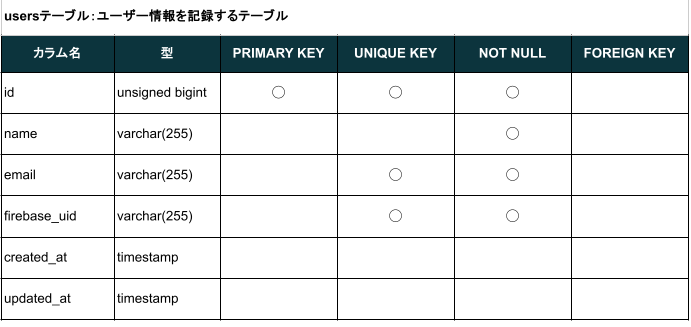
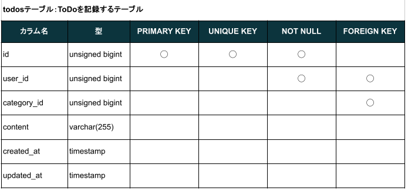
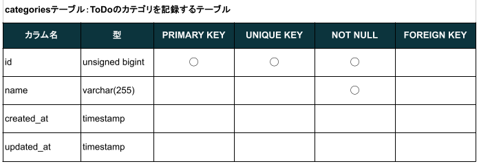

# coachtechフリマ SPA版

ある企業が開発した独自のフリマアプリです。アイテムの出品と購入を行うことができます。

||
|:-:|

## アプリの概要

- 「実践学習ターム 模擬案件初級 フリマアプリ」の案件資料をベースに、バックエンドをLaravel、フロントエンドをNuxt.jsで構築してSPA化しました。

## アプリケーションURL

### バックエンド

- 開発環境(Laravel)：<http://localhost:8000/>
- phpMyAdmin：<http://localhost:8080>
- MailHog：<http://localhost:8025>

### フロントエンド

- 開発環境(Nuxt.js)：<http://localhost:3000/>

## 動作検証に必要なサイト

- Stripe : <https://stripe.com/>
  - 商品購入時の料金のコンビニ決済、および、カード決済のデモに使用します。 
  - 上記のStripe公式サイトにてユーザー登録し、開発者ページにてStripe APIキー(公開可能キーとシークレットキー)を取得してください。

## 他のリポジトリ

なし

## 使用技術(実行環境)

### バックエンド (Laravel)

- PHP 8.3.10
- Laravel 8.83.8
- MySQL 8.0.26

### フロントエンド (Nuxt.js)

- nuxt 3.15.4

## バックエンドアプリ環境構築

### Dockerビルド

1. githubからcloneを作成してください

    ``` bash
    git clone git@github.com:TakaharaYuichiro/freema.git
    ```

2. DockerDesktopアプリを立ち上げてください

3. cloneしたディレクトリ内のfreema-backディレクトリに移動してください

    ``` bash
    cd freema-back/
    ```

4. 以下のコマンドによりDockerをビルド・起動してください

    ``` bash
    docker-compose up -d --build
    ```

    > MacのM1・M2チップのPCの場合、
    > `no matching manifest for linux/arm64/v8 in the manifest list entries`
    > のメッセージが表示されビルドができないことがあります。
    > エラーが発生する場合は、docker-compose.ymlファイルの「mysql」内に「platform」の項目を追加で記載してください。
    >
    > ``` bash
    > mysql:
    >     platform: linux/x86_64 (この文追加)
    >     image: mysql:8.0.26
    >     environment:
    > ```

### Laravel環境構築

1. freema-back/src直下の「.env.example」ファイルをコピーし「.env」に名称を変更してください。または、新しく.envファイルを作成してください

2. .envファイル内の以下の環境変数を、以下のとおり変更もしくは追加してください

    ``` text
    DB_CONNECTION=mysql
    DB_HOST=mysql
    DB_PORT=3306
    DB_DATABASE=laravel_db
    DB_USERNAME=laravel_user
    DB_PASSWORD=laravel_pass

    MAIL_MAILER=smtp
    MAIL_HOST=mailhog
    MAIL_PORT=1025
    MAIL_USERNAME=null
    MAIL_PASSWORD=null
    MAIL_ENCRYPTION=null
    MAIL_FROM_ADDRESS="test_mail@ex.com"  # MailHog送信テスト用
    MAIL_FROM_NAME="${APP_NAME}"

    STRIPE_SECRET_KEY=sk_test_xxxxx
    ```

    > 「sk_test_xxxxxxx」は、Stripe APIキーのシークレットキーです。
    > Stripeの公式サイト(<https://stripe.com/>)の開発者ページから取得したシークレットキーを記載してください。
    > (※)公開可能キー(pk_test_xxxxx)は、フロントエンド側(Nuxt.js)の.envに記載してください。

3. 以下のコマンドでPHPコンテナにログインしてください

    ``` bash
    docker-compose exec php bash
    ``` 

4. パッケージをインストールしてください

    ``` bash
    composer install
    ```

5. アプリケーションキーを作成してください

    ``` bash
    php artisan key:generate
    ```

6. マイグレーションを実行してください

    ``` bash
    php artisan migrate
    ```

7. シーディングを実行してください

    ``` bash
    php artisan db:seed
    ```

8. シンボリックリンクを作成してください

    ``` bash
    php artisan storage:link
    ```

## フロントエンドアプリ環境構築

### Nuxt.js環境構築

1. freema-frontディレクトリに移動してください

    ``` bash
    cd freema-front/
    ```

2. そのディレクトリ直下の「.env.example」ファイルをコピーし「.env」に名称を変更してください。または、新しく.envファイルを作成してください

3. .envファイル内のFirebaseに関する設定を記載してください

    ``` text

    NUXT_PUBLIC_BACK_URL_BASE=http://localhost:8000
    NUXT_PUBLIC_IMAGE_URL_BASE=http://localhost:8000/storage
    NUXT_PUBLIC_STRIPE_PUBLIC_KEY=pk_test_xxxxxxx

    ```

    > 「pk_test_xxxxxxx」は、Stripe APIキーの公開可能キーです。
    > Stripeの公式サイト(<https://stripe.com/>)の開発者ページから取得した公開可能キーを記載してください。
    > (※)シークレットキー(sk_test_xxxxx)は、バックエンド側(Laravel)の.envに記載してください。

4. yarnをインストールしてください

    ``` bash
    yarn install
    ```

## 動作検証方法

### テスト用アカウント

シーディングにより、以下のテスト用アカウントが登録されています。
テストする機能に応じていずれかのアカウントでログインしてください。

- 登録済みのテスト用アカウント一覧

    |Email|Password|ユーザー名|
    |:---|:---|:---|
    |test1@test.com|test_pw1234|テストユーザー1|
    |test2@test.com|test_pw1234|テストユーザー2|
    |test3@test.com|test_pw1234|テストユーザー3|

    > 本アプリは、ログインしなくてもゲストユーザーとして、商品一覧および商品詳細ページを閲覧できます。
    > ただし、ゲストユーザーではお気に入り登録、商品購入などの主要機能は使用できません。

### アプリ起動

1. freema-frontディレクトリに移動してください
2. 以下のコマンドにより開発用サーバーを起動してください

    ``` bash
    yarn dev
    ```

3. ブラウザでlocalhost:3000にアクセスしてください

    ``` bash
    http://localhost:3000/
    ```

### ログイン方法

上記の登録済みのテスト用アカウントでテストする場合は、以下の方法によりログインしてください。

1. ログイン画面で、メールアドレス、パスワードを入力し、「ログイン」をクリックしてください
2. アプリのホーム画面(商品一覧画面)が表示されます

### 新規アカウント登録方法

上記の登録済みのテスト用アカウント以外でテストする場合は、以下の方法により会員登録してアカウントを新規作成してください。

1. ログインせず(ゲストユーザーで)ホーム画面にアクセスしている場合は、画面左上の「ログイン」をクリックしてください。また、他のユーザーでログインしている場合は、画面左上の「ログアウト」をクリックし、一旦ログアウトしてください。
2. ログイン画面の下部にある「会員登録はこちら」をクリックしてください。

    

3. 会員登録画面で名前とメールアドレス、パスワード、確認用パスワードを入力してください。
4. 同じく会員登録画面で「登録する」をクリックすると、MailHogに確認メールが送信されます (この時点では会員登録は終了していません)。
5. ブラウザで別のタブを開き、localhost:8025にアクセスして、MailHogを起動してください。
6. MailHogに届いた「メールアドレス確認」のメールを開き、メールに記載されている「メールアドレスを確認する」(もしくはURLリンク)をクリックしてください。
7. 会員登録が完了するとアプリにログインできます。

## API仕様

### ユーザー登録

Firebaseに登録したユーザーのuidと、その他のユーザー情報を紐づけるためのテーブルにデータを登録します。

* [ユーザー登録](readme/apis/register.md) : `POST /api/register`

### ユーザーデータ取得

DBに登録されているユーザーデータを取得します。

* [ユーザー一覧取得](readme/apis/users.md) : `GET /api/users/`
* [ユーザーチェック](readme/apis/usercheck.md) : `GET /api/usercheck/`

### ToDoデータ操作

ToDoデータの取得や登録などの操作をするためのエンドポイントです。

* [全てのデータ取得](readme/apis/todo/index.md) : `GET /api/todo/`
* [データ登録](readme/apis/todo/store.md) : `POST /api/todo/`
* [データ取得](readme/apis/todo/show.md) : `GET /api/todo/{id}/`
* [データ更新](readme/apis/todo/update.md) : `PUT /api/todo/{id}/`
* [データ削除](readme/apis/todo/destroy.md) : `DELETE /api/todo/{id}/`

### Categoryデータ操作

Categoryデータの取得や登録などの操作をするためのエンドポイントです。

* [全てのデータ取得](readme/apis/category/index.md) : `GET /api/category/`
* [データ登録](readme/apis/category/store.md) : `POST /api/category/`
* [データ取得](readme/apis/category/show.md) : `GET /api/category/{id}/`
* [データ更新](readme/apis/category/update.md) : `PUT /api/category/{id}/`
* [データ削除](readme/apis/category/destroy.md) : `DELETE /api/category/{id}/`

## テーブル設計





## ER図


以上