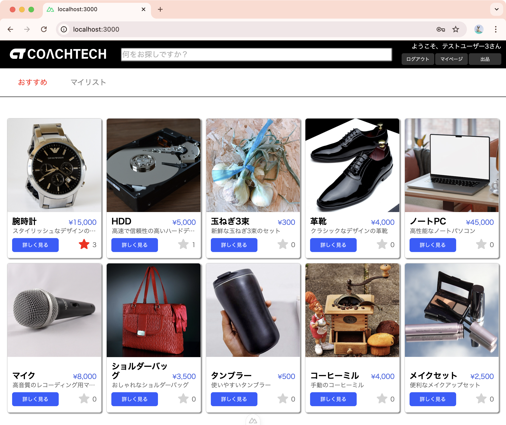
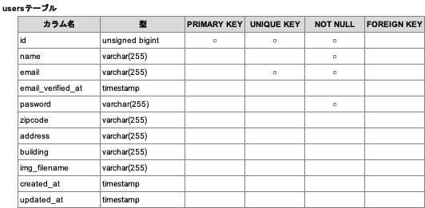
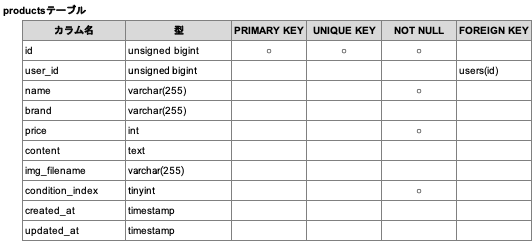
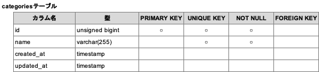
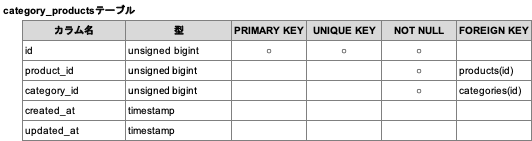
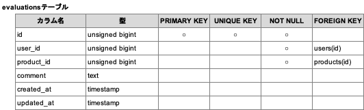
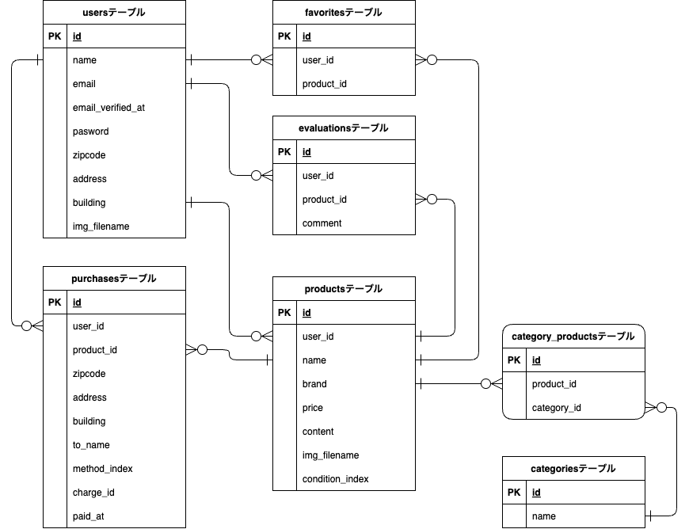

# coachtechフリマ SPA版

ある企業が開発した独自のフリマアプリです。商品の出品や購入を行うことができます。

||
|:-:|

---

## アプリの概要

- 「実践学習ターム 模擬案件初級 フリマアプリ」の案件シートに記載の内容をベースに、バックエンドをLaravel、フロントエンドをNuxt.jsで構築してSPA化しました。

---

## アプリケーションURL

### バックエンド

- 開発環境(Laravel)：<http://localhost:8000/>
- phpMyAdmin：<http://localhost:8080>
- MailHog：<http://localhost:8025>

### フロントエンド

- 開発環境(Nuxt.js)：<http://localhost:3000/>

---

## 動作検証に必要なサイト

- Stripe : <https://stripe.com/>

---

## 他のリポジトリ

なし

---

## 使用技術(実行環境)

### バックエンド (Laravel)

- PHP 8.3.10
- Laravel 8.83.8
- MySQL 8.0.26

### フロントエンド (Nuxt.js)

- nuxt 3.15.4

---

## セットアップ手順

### Stripe APIキー取得

- 本アプリでは、商品購入時の「コンビニ決済」および「クレジットカード決済」に **Stripe** を利用しています。
- 事前に、以下の手順でStripeアカウントおよびAPIキーを取得し、コンビニ決済機能を有効化してください。

1. Stripe 公式サイト（<https://stripe.com/>）にアクセスし、ユーザー登録を行ってください。
2. ログイン後、Stripeのテスト環境で「開発者」から「APIキー」を選択して、以下の 2 種類のテスト用 API キーを取得してください。
   - **公開可能キー（例：`pk_test_xxxxx`）**
   - **シークレットキー（例：`sk_test_xxxxx`）**

    > ※ 取得したキーは、後述の `.env` ファイル設定時に使用するため、メモ帳などに控えておいてください。

3. 同じくStripeのテスト環境で、「設定」→「決済」→「決済手段」から「コンビニ決済」を選択し、コンビニ決済を有効にしてください。

    > 「APIキー」、「コンビニ決済」の設定画面が見当たらない場合は、検索バーに「APIキー」や「決済手段」などのキーワードを入力して検索してください。

### リポジトリのクローン作成

1. GitHubからリポジトリをクローンしてください。

    ``` bash
    git clone git@github.com:TakaharaYuichiro/freema.git
    ```

2. 以下は環境構築に関連する主要なディレクトリおよびファイル構成です。

        .
        ├── freema-back
        │   ├── docker-compose.yml
        │   └── src
        │       └── .env.example
        ├── freema-front
        │   └── .env.example

### バックエンドアプリ環境構築 (Dockerビルド、Laravel環境構築)

1. Docker Desktopを起動してください。

2. クローンしたプロジェクト内の `freema-back` ディレクトリに移動してください。

    ``` bash
    cd freema-back/
    ```

3. 以下のコマンドによりDockerをビルド・起動してください。

    ``` bash
    docker-compose up -d --build
    ```

    > MacのM1・M2チップのPCの場合、
    > `no matching manifest for linux/arm64/v8 in the manifest list entries`
    > というエラーが表示され、ビルドできない場合があります。
    > エラーが発生する場合は、docker-compose.ymlファイルの「mysql」内に「platform」の項目を追加で記載してください。
    >
    > ``` bash
    > mysql:
    >     platform: linux/x86_64 # ← この行を追加
    >     image: mysql:8.0.26
    >     environment:
    > ```

4. `freema-back/src` ディレクトリに移動してください。

    ``` bash
    cd src/
    ```

5. 「.env.example」をコピーし、コピーしたファイルの名称を「.env」に変更してください。

    ``` bash
    cp .env.example .env
    ```

6. .env ファイルを開き、最下部の sk_test_xxxxx を Stripe APIキーの<u>シークレットキー</u>に置き換えてください。

    ``` text
    STRIPE_SECRET_KEY=sk_test_xxxxx
    ```

    > APIキーはStripeの公式サイト(<https://stripe.com/>)の開発者ページから取得してください。
    > なお、同サイトで取得した<u>公開可能キー</u>(pk_test_xxxxx)は、フロントエンド側(Nuxt.js)の.envに記載してください。

7. freema-back に戻り、以下のコマンドで PHP コンテナにログインしてください。

    ``` bash
    cd ..
    docker-compose exec php bash
    ```

8. パッケージをインストールしてください。

    ``` bash
    composer install
    ```

9. アプリケーションキーを作成してください。

    ``` bash
    php artisan key:generate
    ```

10. マイグレーションを実行してください。

    ``` bash
    php artisan migrate
    ```

11. シーディングを実行してください。

    ``` bash
    php artisan db:seed
    ```

12. シンボリックリンクを作成してください。

    ``` bash
    php artisan storage:link
    ```

13. 以下のカスタムコマンドを実行してください。

    ``` bash
    php artisan custom:copy-default-images
    ```

    > `copy-default-images` は、`resorces/defaultImages` にあるダミーデータ用の画像ファイルをstorageにコピーするカスタムコマンドです。

14. PHPコンテナからログアウトしてください。

    ``` bash
    exit
    ```

### フロントエンドアプリ環境構築 (Nuxt.js環境構築)

1. クローンしたプロジェクト内の `freema-front` ディレクトリに移動してください。

    ``` bash
    cd ..
    cd freema-front/
    ```

2. 「.env.example」ファイルをコピーし「.env」に名称を変更してください。

    ``` bash
    cp .env.example .env
    ```

3. .envファイルを開き、最下部の「pk_test_xxxxx」を、Stripe APIキーの<u>公開可能キー</u>に置き換えてください。

    ``` text
    NUXT_PUBLIC_STRIPE_PUBLIC_KEY=pk_test_xxxxx
    ```

    > APIキーはStripeの公式サイト(<https://stripe.com/>)の開発者ページから取得してください。
    > なお、同サイトで取得した<u>シークレットキー</u>(sk_test_xxxxx)は、バックエンド側(Laravel)の.envに記載してください。

4. 依存パッケージをインストールしてください（Yarn が必要です）。

    ``` bash
    yarn install
    ```

    > 依存パッケージのインストールには、以下のバージョンが推奨されます。
    >
    > - Node.js: >= 18.x
    > - Yarn: 1.22.x（Yarn 1.x 系）
    >
    > Yarn 2（Berry）は非対応です。必ず Yarn 1.x を使用してください。
    >
    > ※ 以下のコマンドでバージョンを確認できます。
    >
    > ```bash
    > node -v
    > yarn -v
    > ```

以上でセットアップは完了です。

---

## 動作確認

### アプリの起動

1. `freema-front` ディレクトリに移動します。
2. 以下のコマンドで開発用サーバーを起動します。

    ```bash
    yarn dev
    ```

3. ブラウザで以下の URL にアクセスします。

    ```
    http://localhost:3000/
    ```

### ログイン方法

1. ホーム画面左上の「ログイン」をクリックし、ログイン画面に移動します。
2. メールアドレスとパスワードを入力し、「ログイン」をクリックしてください。

   > ✅ 以下のテスト用アカウントが初期状態で登録されています（シーディング済み）：
   >
   > | メールアドレス         | パスワード     | ユーザー名       |
   > |------------------------|----------------|------------------|
   > | test1@test.com         | test_pw1234    | テストユーザー1 |
   > | test2@test.com         | test_pw1234    | テストユーザー2 |
   > | test3@test.com         | test_pw1234    | テストユーザー3 |

   > ⚠️ 初期登録されている10件の商品には、以下のように出品者が設定されています。  
   > 出品した本人の商品は商品一覧に表示されないためご注意ください。
   >
   > | 商品名                                  | 出品ユーザー     |
   > |-----------------------------------------|------------------|
   > | 玉ねぎ3束、革靴、ノートPC、マイク      | テストユーザー1 |
   > | 腕時計、HDD、バッグ、タンブラーなど     | テストユーザー2 |

   > 💡 本アプリでは、**ゲストユーザーとしても商品一覧・詳細ページの閲覧が可能**です。
   > ただし、**お気に入り登録・購入などはログインが必要**です。

### 新規会員登録方法

テスト用アカウント以外で動作確認を行う場合は、以下の手順で新規登録を行ってください。

1. ホーム画面左上の「ログイン」をクリックし、ログイン画面に移動します。  
   すでにログインしている場合は「ログアウト」をクリックして、一度ログアウトしてください。

2. ログイン画面下部の「会員登録はこちら」をクリックします。

3. 会員登録画面で以下の情報を入力し、「登録する」をクリックします。  
   - 名前  
   - メールアドレス  
   - パスワード  
   - 確認用パスワード  

   → これにより **MailHog** に確認メールが送信されます（この時点ではまだ登録は完了していません）。

4. 別のブラウザタブで、以下の URL にアクセスして MailHog を開きます。

    ```
    http://localhost:8025/
    ```

5. MailHog に届いた「メールアドレス確認」メールを開き、「メールアドレスを確認する」ボタンをクリックしてください。  
   ボタンが表示されない場合は、記載された URL を直接クリックします。

6. メールアドレスが確認されると、アプリにログイン可能となります。

### 【注意事項】商品出品時の「販売価格」について

- 本アプリでは Stripe を使用して、**コンビニ支払い・カード支払い**による決済が可能です。  
ただし、**Stripe の仕様により最低金額が定められています**。

   | 決済方法     | 最低金額 |
   |:------------:|---------:|
   | コンビニ支払い | 120円    |
   | カード払い     | 50円     |

- 商品出品時の「販売価格」は 0 円以上に設定できますが、50円未満の価格では購入処理ができません。  
**動作検証の際は、販売価格を最低でも 50円以上、できれば 120円以上に設定してください。**

---

## テストコード

- 本プロジェクトには、**Vitest** を使用したユニットテストが含まれています。
- 以下のコマンドでテストを実行できます。

    ```bash
    yarn test
    ```

- テストケース一覧：

  | No | テスト対象機能             | テストファイル名             |
  |:--:|----------------------------|-------------------------------|
  | 1  | 会員登録機能               | `register.spec.ts`           |
  | 2  | ログイン機能               | `login.spec.ts`              |
  | 3  | ログアウト機能             | `logout.spec.ts`             |
  | 4  | 商品一覧取得               | `index.spec.ts`              |
  | 5  | マイリスト一覧取得         | `index.spec.ts`              |
  | 6  | 商品検索機能               | `index-search.spec.ts`       |
  | 7  | 商品詳細情報取得           | `detail.spec.ts`             |
  | 8  | いいね機能                 | `detail-favorite.spec.ts`    |
  | 9  | コメント送信機能           | `detail-comment.spec.ts`     |
  | 10 | 商品購入機能               | `purchase.spec.ts`           |
  | 11 | 支払い方法選択機能         | `purchase-addition.spec.ts`  |
  | 12 | 配送先変更機能             | `purchase-addition.spec.ts`  |
  | 13 | ユーザー情報取得           | `mypage.spec.ts`             |
  | 14 | ユーザー情報変更           | `mypage.spec.ts`             |
  | 15 | 出品商品情報登録           | `sell.spec.ts`               |

  > テストファイルは `freema-front/tests/unit/pages/` ディレクトリ内に保存されています。

---

## 設計仕様

### テーブル設計









### ER図



### API仕様

#### 会員登録

会員情報を登録します。なお、この処理では「仮登録」となり、「本登録」のためにはメール確認の処理が必要です。

- [会員登録](readme/apis/register.md) : `POST /api/register`

#### 会員登録 本人確認

メールによる本人確認を行います。メールの送信や、DBの会員情報を「本登録」に変更する処理を実施します。

- [確認メール送信](readme/apis/verify_email/verification-notification.md) : `POST /api/email/verification-notification`
- [確認メールリンク認証](readme/apis/verify_email/verify.md) : `GET /api/email/verify/{id}/{hash}`
- [確認メール再送信](readme/apis/verify_email/resend.md) : `POST /api/email/resend`

#### ログイン

メールアドレスとパスワードを使ってログインします。

- [ログイン](readme/apis/login.md) : `POST /api/login`

#### ユーザーデータ処理

usersテーブルのデータ取得や登録などの操作をするためのエンドポイントです。

- [全てのデータ取得](readme/apis/users/index.md) : `GET /api/users`
- [データ登録](readme/apis/users/store.md) : `POST /api/users`
- [データ取得](readme/apis/users/show.md) : `GET /api/users/{id}`
- [データ更新](readme/apis/users/update.md) : `PUT /api/users/{id}`
- [データ削除](readme/apis/users/destroy.md) : `DELETE /api/users/{id}`

#### 商品データ処理

productsテーブルのデータ取得や登録などの操作をするためのエンドポイントです。

- [全てのデータ取得](readme/apis/products/index.md) : `GET /api/products`
- [データ登録](readme/apis/products/store.md) : `POST /api/products`
- [データ取得](readme/apis/products/show.md) : `GET /api/products/{id}`
- [データ更新](readme/apis/products/update.md) : `PUT /api/products/{id}`
- [データ削除](readme/apis/products/destroy.md) : `DELETE /api/products/{id}`

#### 商品購入データ処理

purchasesテーブルのデータ取得や登録などの操作をするためのエンドポイントです。

- [全てのデータ取得](readme/apis/purchases/index.md) : `GET /api/purchases`
- [データ登録](readme/apis/purchases/store.md) : `POST /api/purchases`
- [データ取得](readme/apis/purchases/show.md) : `GET /api/purchases/{id}`
- [データ更新](readme/apis/purchases/update.md) : `PUT /api/purchases/{id}`
- [データ削除](readme/apis/purchases/destroy.md) : `DELETE /api/purchases/{id}`

#### カテゴリデータ処理

categoriesテーブルのデータ取得や登録などの操作をするためのエンドポイントです。

- [全てのデータ取得](readme/apis/categories/index.md) : `GET /api/categories`
- [データ登録](readme/apis/categories/store.md) : `POST /api/categories`
- [データ取得](readme/apis/categories/show.md) : `GET /api/categories/{id}`
- [データ更新](readme/apis/categories/update.md) : `PUT /api/categories/{id}`
- [データ削除](readme/apis/categories/destroy.md) : `DELETE /api/categories/{id}`

#### 評価(コメント)データ処理

evaluationsテーブルのデータ取得や登録などの操作をするためのエンドポイントです。

- [全てのデータ取得](readme/apis/evaluations/index.md) : `GET /api/evaluations`
- [データ登録](readme/apis/evaluations/store.md) : `POST /api/evaluations`
- [データ取得](readme/apis/evaluations/show.md) : `GET /api/evaluations/{id}`
- [データ更新](readme/apis/evaluations/update.md) : `PUT /api/evaluations/{id}`
- [データ削除](readme/apis/evaluations/destroy.md) : `DELETE /api/evaluations/{id}`

#### カテゴリ-商品中間テーブルデータ処理

category-productsテーブル(categoriesとproductsの中間テーブル)にデータを登録します。

- [データ登録](readme/apis/category_products/store.md) : `POST /api/category-products`

#### お気に入りデータ評価処理

favoritesテーブルに関連するデータ処理を行います。

- [全てのデータ取得](readme/apis/favorites/get-favorites_index.md) : `GET /api/get-favorites`
- [データ取得](readme/apis/favorites/get-favorites_show.md) : `GET /api/get-favorites/{product_id}`
- [登録数カウント](readme/apis/favorites/count-favorites.md) : `GET /api/count-favorites/{product_id}`
- [お気に入り登録/解除](readme/apis/favorites/invert-favorites.md) : `POST /api/invert-favorite`

#### 画像アップロード処理

画像ファイルをアップロードします。

- [アップロード](readme/apis/upload-image.md) : `POST /api/upload-image`

以上
